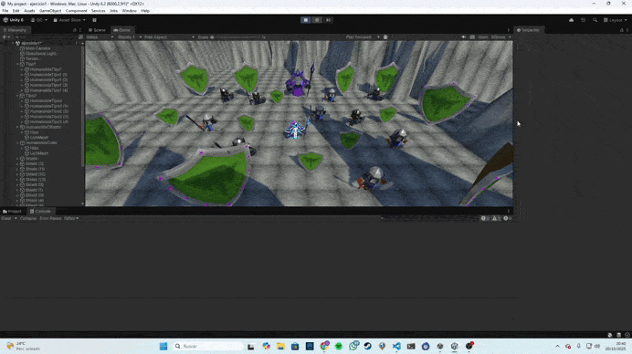

# Ejercicios Eventos

## Ejercicio 1
Hice que cinco esferas rojas (tipo 1) y verdes (tipo 2) se movieran hacia objetivos cuando el cubo colisiona con un cilindro. [Enlace al Script1](scripts/SphereMover.cs) [Enlace al Script2](scripts/CubeMovement.cs) [Enlace al Script3](scripts/CylinderCollision.cs)

## Ejercicio 2
Sustituí las esferas por humanoides de tipo 1 y tipo 2 y mantuve la mecánica de movimiento hacia objetivos usando prefabs.  

## Ejercicio 3 y 9
Cuando el cubo toca un humanoide tipo 2, los del grupo 1 se acercan a un escudo seleccionado; si toca un humanoide tipo 1, los del grupo 2 se acercan a escudos del grupo 2. Además, los humanoides cambian de color al colisionar con los escudos. Implementé el ejercicio 3 haciendo que el cubo sea un objeto físico con Rigidbody, afectado por la gravedad y las colisiones, pero aún controlable con las teclas de movimiento. [Enlace al Script1](scripts/HumanoidMover.cs) [Enlace al Script2](scripts/CubeCollision.cs)  

## Ejercicio 4
Los humanoides tipo 1 se teletransportan a un escudo objetivo cuando el cubo se aproxima al cilindro de referencia, mientras los humanoides tipo 2 se orientan hacia un objeto específico en la escena. [Enlace al Script](scripts/CubeProximity.cs) 

## Ejercicio 5
Implementé la mecánica de recolectar escudos que actualiza la puntuación del jugador: los escudos de tipo 1 suman 5 puntos y los de tipo 2 suman 10, mostrando la puntuación en la consola. [Enlace al Script](scripts/ShieldCollector.cs)  

## Ejercicio 6
Creé una interfaz con Canvas y TextMeshPro para mostrar la puntuación que obtiene el cubo en tiempo real. [Enlace al Script](scripts/ShieldCollector.cs)  

## Ejercicio 7
Cada 100 puntos, el jugador obtiene una recompensa que se muestra en la UI mediante un texto que aparece temporalmente. [Enlace al Script](scripts/ShieldCollector.cs)  

## Ejercicio 8
Generé una escena completa integrando humanoides, escudos, cubo jugador y las mecánicas anteriores, con puntuación y recompensas.

